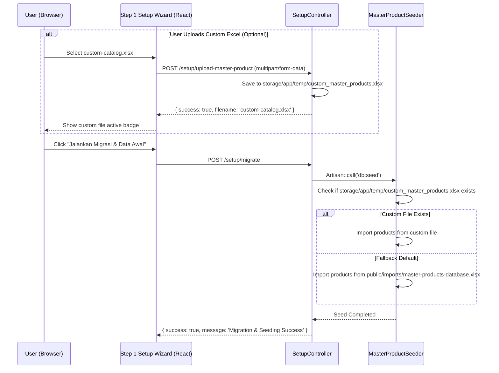

# Spec Design: Optional Custom Master Product Upload in Quick Setup Wizard

## Overview
Fitur ini memungkinkan pengguna pada **Step 1 Quick Setup Wizard** untuk mengunggah file katalog produk master kustom berformat Excel (`.xlsx` / `.xls`) secara opsional. Jika pengguna mengunggah file kustom, sistem akan seeding data dari file tersebut. Jika tidak diunggah, sistem secara otomatis *fallback* menggunakan file katalog bawaan (`public/imports/master-products-database.xlsx`).

---

## User Experience & UI Flow

1. **Step 1 (Database & Initial Data Setup)**:
   - Di bawah formulir konfigurasi database, tambahkan seksi **"Katalog Master Produk (Opsional)"**.
   - Komponen UI berupa File Dropzone / Input Selector:
     - Menerima file dengan ekstensi `.xlsx` dan `.xls`.
     - Keterangan: *"Unggah file katalog produk kustom Anda (.xlsx / .xls) atau biarkan kosong untuk menggunakan katalog bawaan (14.000+ produk default)."*
   - Jika pengguna memilih/mengunggah file:
     - File diunggah secara instan via API AJAX `/setup/upload-master-product`.
     - Menampilkan indikator loading saat pengunggahan.
     - Setelah sukses, tampilkan badge hijau dengan Nama File, Ukuran File, dan tombol **"Ganti / Hapus File (Gunakan Default)"**.
   - Jika pengguna menghapus file kustom:
     - Mengirim request ke `/setup/reset-master-product` untuk menghapus file sementara, dan tampilan kembali ke mode *Default Catalog*.

2. **Eksekusi Migrasi & Seeding**:
   - Pengguna menekan tombol **"Jalankan Migrasi & Data Awal"** seperti biasa.
   - Backend seeder akan mengecek ketersediaan file kustom terlebih dahulu.

---

## Architecture & Data Flow



---

## Endpoint Specification

### 1. Upload Custom Master Product
- **URL**: `POST /setup/upload-master-product`
- **Payload**: `file` (Required, file mimes: `xlsx, xls`, max: 20MB)
- **Response Success (200)**:
  ```json
  {
    "success": true,
    "message": "File katalog kustom berhasil diunggah.",
    "filename": "daftar_produk_toko.xlsx",
    "size": "2.4 MB"
  }
  ```
- **Response Error (422/500)**:
  ```json
  {
    "success": false,
    "message": "Format file harus berformat Excel (.xlsx / .xls)."
  }
  ```

### 2. Reset Custom Master Product
- **URL**: `DELETE /setup/reset-master-product`
- **Response Success (200)**:
  ```json
  {
    "success": true,
    "message": "Kembali menggunakan file katalog default."
  }
  ```

---

## Implementation Details

### 1. `SetupController.php`
- `uploadMasterProduct(Request $request)`:
  - Validasi: `'file' => 'required|file|mimes:xlsx,xls|max:20480'`
  - Simpan file ke `storage_path('app/temp/custom_master_products.xlsx')`.
- `resetMasterProduct()`:
  - Hapus file `storage_path('app/temp/custom_master_products.xlsx')` jika ada.

### 2. `MasterProductSeeder.php`
- Modifikasi logika pembacaan file:
  ```php
  $customFilePath = storage_path('app/temp/custom_master_products.xlsx');
  $defaultFilePath = public_path('imports/master-products-database.xlsx');

  $publicFilePath = file_exists($customFilePath) ? $customFilePath : $defaultFilePath;
  ```
- Setelah seeding selesai di `run()`, hapus file `$customFilePath` jika ada agar tidak mempengaruhi instalasi berikutnya.

### 3. Frontend (`resources/js/pages/setup/index.tsx`)
- Menambahkan state:
  - `customFile: { name: string, size: string } | null`
  - `uploadingCustomFile: boolean`
- Menambahkan seksi File Upload di Step 1 UI dengan gaya visual Shadcn UI / TailwindCSS (Dark & Light mode support).

---

## Verification & Testing Plan

1. **Unit & Feature Test (`tests/Feature/Setup/MasterProductUploadTest.php`)**:
   - Test upload file valid `.xlsx` -> Pastikan tersimpan di `storage/app/temp/custom_master_products.xlsx`.
   - Test upload file invalid `.pdf` -> Pastikan ditolak dengan error 422.
   - Test reset file -> Pastikan file temporary terhapus.
   - Test seeding dengan file kustom -> Pastikan data pada file kustom masuk ke tabel `master_products`.
   - Test seeding tanpa file kustom -> Pastikan fallback menggunakan file `public/imports/master-products-database.xlsx`.

2. **Frontend Visual & UX Verification**:
   - Memastikan tombol upload, indikator loading, dan badge file aktif berfungsi secara responsif pada light dan dark mode.
